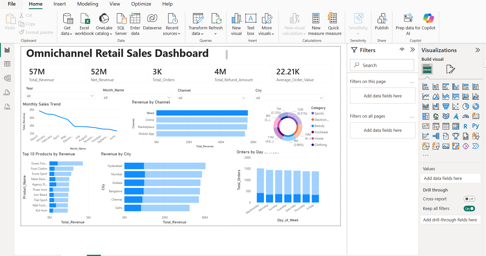

# Omnichannel Retail Sales and Inventory Analytics Dashboard

## Project Overview
This is a Data Analytics internship project based on omnichannel retail sales. The project analyzes sales from Store, Online, Marketplace, and Mobile App channels to understand revenue, product performance, customer location, returns, and inventory status.

## Tools Used
- Python and Pandas for data cleaning
- Jupyter Notebook in VS Code for Week 1 work
- MySQL Workbench for SQL analysis
- Power BI for dashboard creation
- Git and GitHub for version control and submission

## Dataset

| File | Rows | Description |
|---|---:|---|
| sales_transactions.csv | 10,000 | Sales transaction records |
| customers.csv | 1,000 | Customer details |
| products.csv | 200 | Product catalog |
| inventory.csv | 500 | Inventory stock details |
| returns.csv | 1,200 | Return and refund records |

## Project Work Completed

### Week 1: Data Cleaning
- Loaded all datasets using Python Pandas
- Checked missing values and duplicates
- Fixed date format
- Created new columns like Year, Month, Month_Name, Day_of_Week, and Quarter
- Saved cleaned files inside the cleaned_data folder

### Week 2: SQL Analysis
- Created a MySQL database
- Imported cleaned sales, customer, and product data
- Wrote SQL queries for revenue, channel performance, monthly sales, top products, city revenue, day-wise orders, and quarterly performance

### Week 3: Power BI Dashboard
- Created an interactive dashboard in Power BI
- Added KPI cards, sales trend, channel revenue, top products, city revenue, day-wise orders, and category chart
- Added slicers for Year, Month, Channel, and City

### Week 4: Final Report and Documentation
- Created final insights report
- Added business recommendations
- Updated GitHub documentation
- Added dashboard screenshot for presentation

## Key Results

| Metric | Value |
|---|---:|
| Total Orders | 10,000 |
| Total Revenue | 224.18M |
| Net Revenue | 206.29M |
| Average Order Value | 22.42K |
| Total Refund Amount | 17.90M |
| Return Rate | 11.33% |

## Main Insights
- Store and Online are the top revenue channels.
- Hyderabad is the highest revenue city.
- Sports is the top performing product category.
- March 2026 had the highest monthly revenue.
- Wednesday had the highest number of orders.
- 32 products are at or below reorder level.

## Dashboard Screenshot

## Files in this Repository
- Week1_Data_Cleaning.ipynb
- week2_queries.sql
- Week3_PowerBI_Dashboard.pbix
- final_insights_report.md
- dashboard_screenshot.png
- cleaned_data/
- README.md

## Conclusion
This project gives a complete view of omnichannel retail sales performance. It helps identify high-performing channels, products, cities, and categories, while also showing return and inventory issues. The final dashboard can help a retail business make better data-driven decisions.

## Author
Ayush Gopi  
Data Analytics Internship Project
